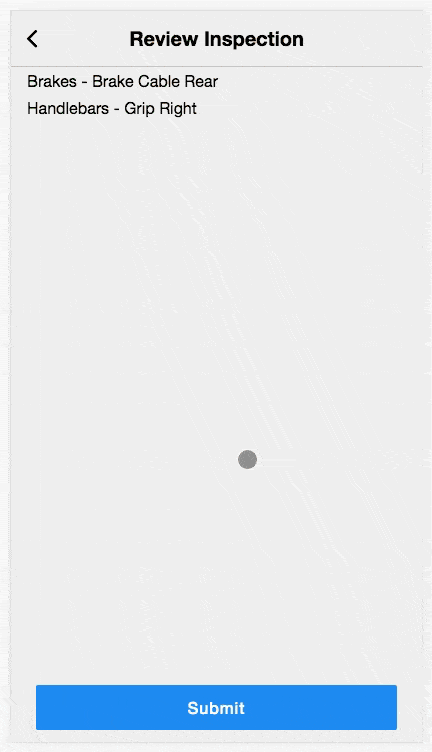

# Animated Toast Notifications In React

An important component of good UX is providing the user with feedback about their actions. Applications should indicate success or failure in an intuitive and attractive way. One option for handling this is a toast notification.

Toast notifications are in-app notifications that briefly appear on the screen after an action is taken. They disappear quickly and usually don't require additional input. One example of this is the confirmation message Gmail shows after you send an email:


This message persists for a few seconds then disappears. It provides a link to the created resource but it does not require the user to do anything. This pattern is powerful and React enables us to implement this is in a clean, reusable fashion.

The Tools Team here at Motivate builds applications and dashboards that enable bike share operators and front line workers to do their jobs more effectively. One of our primary tools is a mobile web application for bike mechanics called Bike Inspector. In this application we've found many uses for the toast notification. One of these is confirmation of bicycle component selection:


When designing this feature we had a few goals in mind:

1. One reusable component, powered by a single data structure, and available to all parts of the application
2. Complete control over the styling, text, and timeout from the code that sets the notification
3. Provide channels for different notification types
4. Proper canceling of async behavior when a new notification is set
5. Animations when the notification component enters and leaves the DOM

Let's first look at how we set a notification. We use [Mobx](https://mobx.js.org/) for state management in Bike Inspector, but this feature could also be implemented with Redux or React Context API. We can achieve goals #1 and #2 with a simple Mobx store and an observer component:

```javascript
import { action, observable, runInAction } from 'mobx'

export class ToastStore {
  @observable notification = {}

  @action setNotification(notification ) {
    this.notification = notification

    setTimeout(() => {
      runInAction(() => this.notification = {})
    }), notification.timeout)
  }
}
```
```javascript
import React from 'react'
import { inject, observer } from 'mobx-react'

@inject('toastStore') @observer
export class ToastNotification extends React.Component {
  render() {
    const { toastStore: { notification } } = this.props

    return (
      <div className="toast-container">
        { notification && notification.message &&
            <div
              className="toast-notification"
              style={ {
                color: notification.textColor,
                backgroundColor: notification.backgroundColor
              } }>
              <i className="fa fa-check" />
              <div className="message-container">
                <span className="message">{ notification.message }</span>
              </div>
            </div> }
      </div>
    )
  }
}
```

```css
.toast-container {
  position: relative;
}

.toast-notification {
  position: absolute;
  top: 0;
  left: 0;
  right: 0;
  z-index: 1;
  padding: 10px;
  display: flex;
  justify-content: center;
  align-items: center;
}

.toast-notification > .fa-check {
  font-size: 20px;
}

.toast-notification > .message-container {
  font-size: 16px;
  line-height: 1.38;
  letter-spacing: 0.6px;
  text-align: left;
  margin-left: 1rem;
}
```

Now any component can set a notification and any component can listen to it. We can achieve our first "Hello, World!" like so:

```javascript
import { inject } from 'mobx-react'
import React from 'react'

export class App extends React.Component {
  render() {
    return (
      <div className="app">
        <ToastNotification />
        <Button />
      </div>
    )
  }
}

@inject('toastStore')
export class Button extends React.Component {
  render() {
    return (
      <button onClick={ this.setNotification }>Say Hello</button>
    )
  }

  setNotification() {
    this.props.toastStore.setNotification({
      message: "Hello, World!",
      textColor: "white",
      backgroundColor: "blue",
      timeout: 1500,
    })
  }
}
```

This implementation works pretty well. It allows you to set notifications in one component and render them in another. There are however some issues that will become apparent once you start implementing this widely throughout your application. You'll eventually want some pages or areas on the page to only listen to certain types of messages. You may also want the notification component to be aware of what type of message it is displaying so that you can conditionally render UI elements:


For error notifications we don't display the checkmark icon. We'll need to add some constants to our `ToastStore`, keep track of each type of message, and check for them when deciding whether to render the `ToastNotification`. In Mobx, the easiest way to observe changes to an associative data structure is by using `observable.map`:

```diff
 export class ToastStore {
+  HELLO_WORLD = "helloWorld"
+  ERROR = "error"

-  notification = {}
+  notifications = observable.map()

-  @action setNotification(notification)
-    this.notification = notification
+  @action setNotification({ channel, ...notification })
+    this.notifications.set(channel, notification)

     setTimeout(() => {
-     runInAction(() => this.notifications = {})
+     runInAction(() => this.notifications.delete(channel))
    }), notification.timeout)
  }
}
```

```diff
 import React from 'react'
 import { inject, observer } from 'mobx-react'

 @inject('toastStore') @observer
 export class ToastNotification extends React.Component {
   render() {
     const { toastStore: { notification }, channels } = this.props

+    const channel = channels.find((channel) => notifications.has(channel)),
+          notification = notifications.get(channel)

     return (
       <div className="toast-container">
         { notification && notification.message &&
             <div
               className="toast-notification"
               style={ {
                 color: notification.textColor,
                 backgroundColor: notification.backgroundColor
               } }>
+              { channel !== toastStore.ERROR && <i className="fa fa-check" /> }
               <div className="message-container">
                 <span className="message">{ notification.message }</span>
               </div>
             </div> }
       </div>
     )
   }
 }
```
To get this to work we just need to add the desired channel to our `setNotification` call and listen on that channel in the `ToastNotification`:

```diff
  import { inject } from 'mobx-react'
  import React from 'react'

+ @inject('toastStore')
  export class App extends React.Component {
    render() {
      return (
        <div className="app">
-        <ToastNotification />
+        <ToastNotification channels={ [this.props.toastStore.helloWorld] } />
         <Button />
        </div>
      )
    }
  }

  @inject('toastStore')
  export class Button extends React.Component {
    render() {
      return (
        <button onClick={ this.setNotification }>Say Hello</button>
      )
    }

    setNotification() {
      this.props.toastStore.setNotification({
        message: "Hello, World!",
+       channel: this.props.toastStore.helloWorld,
        textColor: "white",
        backgroundColor: "blue",
        timeout: 1500,
      })
    }
  }
```

With channels out of the way, there's one last improvement we need to make so that our notifications don't step on each other's toes. What happens if we publish a message to a channel, and then publish another before the first notification's timeout has completed? Our `setTimeout` from the first call is still active. This means that our second notification will be wiped away much faster than we intended. Canceling asynchronous tasks in JavaScript is notoriously fraught, even with new paradigms like async/await. Luckily for us, our old friend `setTimeout` can be cancelled with its companion function, `clearTimeout`, as long as we hold on to the reference:

```diff
 import { action, observable, runInAction } from 'mobx'

 export class ToastStore {
   HELLO_WORLD = "helloWorld"
   ERROR = "error"

   notifications = observable.map()

   @action setNotification({ channel, ...notification }) {
-    runInAction(() => this.notifications.set(channel, notification))
+    if(this.notifications.has(channel)) {
+      clearTimeout(this.notifications.get(channel).timeoutRef)
+    }

-    setTimeout(() => {
+    notification.timeoutRef = setTimeout(() => {
       runInAction(() => this.notifications.delete(channel))
     }, notification.timeout)

+    runInAction(() => this.notifications.set(channel, notification))
   }
 }
```

In Bike Inspector it is possible to submit both an inspection and a repair within the timeout of the notification. By setting the `timeoutRef` on the notification, we're able to clear it when subsequent notifications are sent on the same channel. This leads to logical, well defined behavior:



When a new notification is published, the existing one is immediately overwritten, along with its timeout. The first notification gracefully exits the page while the second persists for the correct amount of time. Of course this looks much nicer with an animation!

Let's start with the `ToastNotification` component. You may be tempted to hand roll your animation logic (I was). You could even create a sweet HOC that toggles the CSS classes at the right time and apply that to your components with a decorator. Trust me though, it's not worth the trouble. React already tracks when our components enter and leave the DOM so it makes sense to lean on it here. The framework provides a nice API for this called [ReactCSSTransitionGroup](https://reactjs.org/docs/animation.html):

```diff
  import React from 'react'
+ import { CSSTransitionGroup } from 'react-transition-group'
  import { inject, observer } from 'mobx-react'

  @inject('toastStore') @observer
  export class ToastNotification extends React.Component {
    render() {
-     const { toastStore: { notification }, channels } = this.props
+     const { toastStore: { notification, animationDuration }, channels } = this.props

      const channel = channels.find((channel) => notifications.has(channel)),
            notification = notifications.get(channel)

      return (
        <div className="toast-container">
+         <CSSTransitionGroup
+            transitionEnterTimeout={ animationDuration }
+            transitionLeaveTimeout={ animationDuration }
+            transitionName="toast-notification">
            { notification && notification.message &&
                <div
+                 key={ notification.message }
                  className="toast-notification"
                  style={ {
                    color: notification.textColor,
                    backgroundColor: notification.backgroundColor,
+                   animationDuration: `${animationDuration}ms`
                  } }>
                  { channel !== toastStore.ERROR && <i className="fa fa-check" /> }
                  <div className="message-container">
                    <span className="message">{ notification.message }</span>
                  </div>
                </div> }
+         </CSSTransitionGroup>
        </div>

     )
   }
 }
```
`CSSTransitionGroup` will apply CSS classes when the component enters and leaves the DOM: `toast-notification-enter` and `toast-notification-leave`. It also prevents its children from unmounting immediately, giving them time to animate out. You must pass a `key` prop to all children, even if there's only one.

Now we can define define our animation styles. We use [Sass](https://sass-lang.com/) and [Animate.css](https://daneden.github.io/animate.css/) to make this process simple:

```scss
$use-slideInDown: true;
$use-slideOutUp: true;

@import "../../node_modules/animate-sass/animate";

.toast-notification-enter {
  @extend .animated, .slideInDown;
}

.toast-notification-leave {
  @extend .animated, .slideOutUp;
}
```

With the SCSS version of Animate.css, we are able to include only the animations we need in our build. Then we extend the two Animate.css classes that are needed in each transition class. Now lets look at the changes we need to make to the ToastStore to ensure our animations are smooth and our application logic is robust:

```diff
import { action, observable, runInAction } from 'mobx'

 export class ToastStore {
   COMPONENT_SELECT = "componentSelect"
   ERROR = "error"

   notifications = observable.map()
+  animationDuration = 500

   @action setNotification({ channel, ...notification }) {
     if(this.notifications.has(channel)) {
       clearTimeout(this.notifications.get(channel).timeoutRef)
     }

     notification.timeoutRef = setTimeout(() => {
-      runInAction(() => this.notifications.delete(channel))
+      this.animatedAction(() => this.notifications.delete(channel))
     }, notification.timeout + 500) // timeout + animate in duration

-    runInAction(() => this.notifications.delete(channel))
+    this.animatedAction(() => this.notifications.set(channel, notification))
   }

+  @action animatedAction(f) {
+    requestAnimationFrame(() => runInAction(f))
+  }
}
```

The first addition here is the `animationDuration`. We decided to set this as a constant on the `ToastStore` because we think this duration is appropriate for all notifications. This could instead be set along with the other values in `setNotification` if you want it to be variable. We then use this constant in `ToastNotification` for both the CSS `animationDuration` and the `CSSTransitionGroup` timeouts. It's very important that these values are kept in sync so it's best to avoid magic numbers.

The second change is the use of [requestAnimationFrame](https://developer.mozilla.org/en-US/docs/Web/API/window/requestAnimationFrame) any time we mutate Mobx state that will lead to an animation. From the Mozilla docs:

> The window.requestAnimationFrame() method tells the browser that you wish to perform an animation and requests that the browser call a specified function to update an animation before the next repaint. The method takes a callback as an argument to be invoked before the repaint.
>
> You should call this method whenever you're ready to update your animation onscreen. This will request that your animation function be called before the browser performs the next repaint. The number of callbacks is usually 60 times per second, but will generally match the display refresh rate in most web browsers as per W3C recommendation. requestAnimationFrame() calls are paused in most browsers when running in background tabs or hidden `<iframes>` in order to improve performance and battery life.

After several iterations we've arrived at a clean, decoupled solution for generating animated toast notifications. You can find the finished example here: *GITHUB LINK GOES HERE*.

## Things to add?

* Shoutout to Raven?
* More about Motivate / LBS? "We're hiring", etc?

